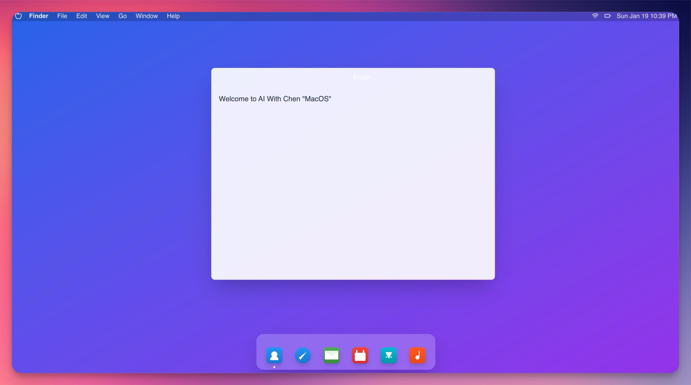
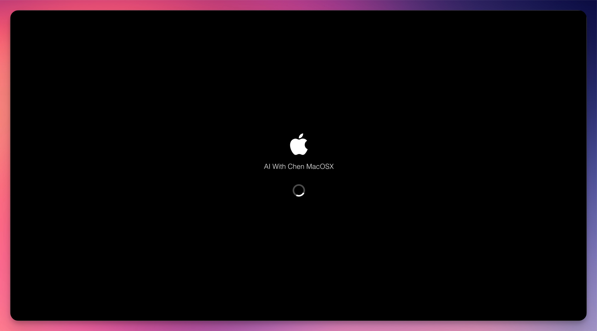
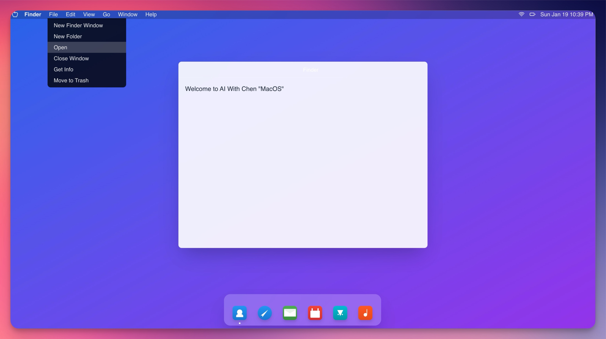
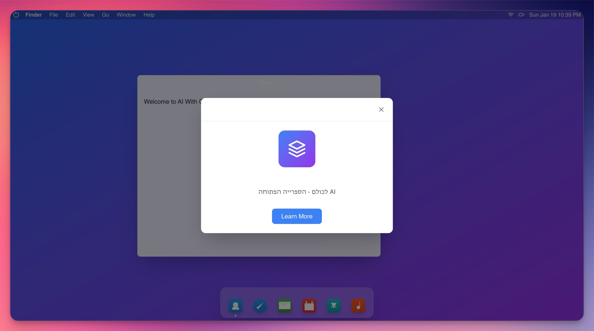

# macOS Clone UI

A modern React-based implementation of the macOS user interface, built with React, TypeScript, and Vite.

[](https://stackblitz.com/~/github.com/ChenReuven/mac-clone)

## 🖥 Screenshots

> 💡 **Note**: Add screenshots of your application here. Suggested screenshots:
> - Main desktop interface
> - Menu bar interaction
> - About modal
> - Window management demonstration






### Demo Video
https://github.com/ChenReuven/mac-clone/raw/main/assets/video.mp4

## ✨ Features

- 🖥 Authentic macOS-like desktop interface
- 🎯 Interactive dock with animations
- 📱 Responsive window management
- 🎨 System-like UI components
- 🌙 Menu bar with interactive elements
- 🎭 Smooth animations using Framer Motion
- 🎯 Drag and drop functionality
- 📅 Real-time clock and date display

## 🚀 Tech Stack

- React 18
- TypeScript
- Vite
- Tailwind CSS
- Framer Motion
- PrimeReact
- DND Kit
- Lucide Icons

## 🛠 Setup & Development

1. **Clone the repository**
   ```bash
   git clone https://github.com/ChenReuven/mac-clone.git
   cd mac-clone
   ```

2. **Install dependencies**
   ```bash
   npm install
   ```

3. **Start development server**
   ```bash
   npm run dev
   ```

4. **Build for production**
   ```bash
   npm run build
   ```

5. **Preview production build**
   ```bash
   npm run preview
   ```

## 🧩 Project Structure

```
mac-clone/
├── src/
│   ├── components/     # UI components
│   ├── App.tsx        # Main application component
│   └── ...
├── public/            # Static assets
└── ...
```

## 🤝 Contributing

Contributions, issues, and feature requests are welcome! Feel free to check the [issues page](https://github.com/ChenReuven/mac-clone/issues).

## 📝 License

This project is [MIT](LICENSE) licensed.

---

Made with ❤️ by [Chen Reuven](https://github.com/ChenReuven)